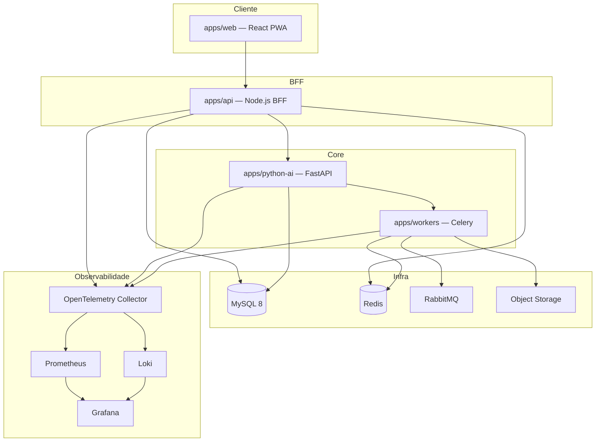

# Visão geral da arquitetura

## Princípios

- **Stateless services** — escala horizontal sem sessão em memória
- **Idempotência** — reprocessamento seguro de jobs
- **Separação de responsabilidades** — cada modelo de IA cobre apenas sua especialidade
- **JSON versionado** — toda saída é estruturada, documentada e versionada
- **Clean Architecture + DDD** — domínio musical isolado de infraestrutura

## Diagrama de serviços



## Pipeline de áudio

```
Entrada (YouTube, upload, S3, Azure Blob, GCS, HTTP)
    ↓
Validação e normalização
    ↓
Conversão para WAV · remoção de silêncio
    ↓
Separação de stems (Demucs v4)
    ↓
Análise por stem (Essentia, Librosa, Madmom, Music21, CREPE, Basic Pitch, Chordino, Whisper, MERT)
    ↓
Merge · Music Knowledge Graph · explicação educacional
    ↓
Persistência · resposta JSON versionada
```

## Modelos de IA e responsabilidades

| Modelo | Responsabilidade exclusiva |
|--------|---------------------------|
| Demucs v4 | Separação de stems |
| Essentia | Features de áudio, gênero, mood |
| Librosa | Análise espectral e temporal |
| Madmom | Beat, downbeat, BPM |
| Music21 | Teoria harmônica, escalas, cadências |
| CREPE | Detecção de pitch |
| Basic Pitch | Transcrição de notas |
| Chordino | Progressão de acordes |
| Whisper Large-v3 | Alinhamento de letras (somente) |
| MERT | Embeddings musicais |
| MusicGen Encoder | Embeddings opcionais |

Nenhum modelo duplica responsabilidade de outro.

## Camadas do serviço Python (`apps/python-ai`)

```
presentation/     # FastAPI routers, DTOs Pydantic v2
application/        # Use cases, orquestração do pipeline
domain/             # Entidades, value objects, interfaces
infrastructure/     # SQLAlchemy, Celery, storage adapters
```

## Formato de saída

Toda resposta de análise segue o schema JSON versionado em `packages/types`. Campos incluem:

- Metadados (título, artista, duração, gênero, mood, idioma)
- Harmonia (tom, modo, BPM, compasso, progressão, cadências, modulações)
- Ritmo (beat, swing, syncopation, groove)
- Estrutura (intro, verso, refrão, ponte, timestamps)
- Instrumentos (detecção com confidence score)
- Performance (dinâmica, energia, loudness)
- Modos educacionais (beginner → professional)
- Modos especializados (worship, guitar, piano, improvisation)

Nunca retorna Markdown ou texto plano misturado ao JSON.

## Portas padrão (desenvolvimento)

| Serviço | Porta |
|---------|-------|
| Web (Vite) | 5173 |
| API (BFF) | 8080 |
| Python AI | 8000 |
| MySQL | 3306 |
| Redis | 6379 |
| RabbitMQ (AMQP) | 5672 |
| RabbitMQ (Management) | 15672 |
| Prometheus | 9090 |
| Grafana | 3000 |
