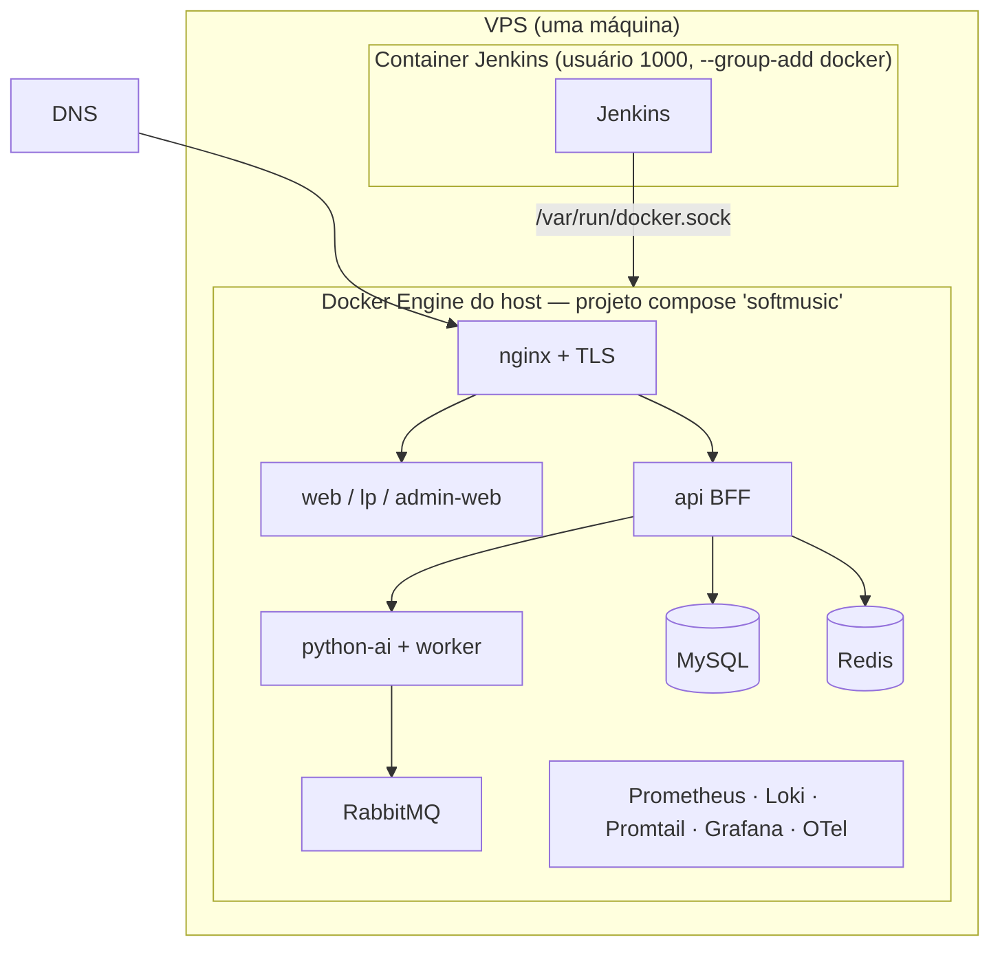

# Deploy em produção (VPS única + Jenkins em container + Docker Compose)

Guia direto para subir o SoftMusic numa **única VPS** onde o **Jenkins roda
dentro de um container** e fala com o daemon Docker do **host** via
`/var/run/docker.sock`. O deploy é **local, sem SSH**: as imagens são buildadas
no daemon do host (**sem push para registry**) e o `docker compose` sobe os
serviços na própria máquina.

> Mesmo padrão do projeto `sportshub` que já roda nesta VPS.
> Objetivo: criar 1 pipeline de infra + 1 para cada app (API, IA, Web),
> cadastrar as credenciais e subir a versão em ~30 min.

## Arquitetura no servidor



Tudo roda no mesmo Docker Engine, no **projeto compose `softmusic`** (rede
`softmusic-network`). Como o Jenkins fala com o daemon do host via socket, todo
**bind mount** de configuração (observabilidade, nginx, `mysql/init`) precisa
apontar para um caminho que o **host** enxergue. Por isso os pipelines **copiam**
os arquivos de deploy para o `DEPLOY_DIR` (dentro do volume do Jenkins) e os bind
mounts usam esse caminho na visão do host (`DEPLOY_DIR_HOST`).

## Pré-requisitos (uma vez só)

### 1. Container do Jenkins com acesso ao Docker do host

```bash
DOCKER_GID=$(getent group docker | cut -d: -f3)

docker run -d \
  --name jenkins \
  --restart unless-stopped \
  -p 8080:8080 -p 50000:50000 \
  -v /dados/jenkins_home:/var/jenkins_home \
  -v /var/run/docker.sock:/var/run/docker.sock \
  -v /usr/bin/docker:/usr/bin/docker \
  --group-add "$DOCKER_GID" \
  jenkins/jenkins:lts

# Se usar docker compose no pipeline, monte o plugin (caminho pode variar):
#   -v /usr/libexec/docker/cli-plugins/docker-compose:/usr/local/lib/docker/cli-plugins/docker-compose
# BuildKit (opcional — pipelines detectam e usam legacy se ausente):
#   -v /usr/libexec/docker/cli-plugins/docker-buildx:/usr/local/lib/docker/cli-plugins/docker-buildx
```

Teste dentro do container:

```bash
docker exec -u jenkins jenkins docker ps
docker exec -u jenkins jenkins docker compose version
docker exec -u jenkins jenkins docker buildx version
```

### 2. DEPLOY_DIR

Os pipelines gravam compose + configs em `DEPLOY_DIR`. Defaults (ajustáveis por
*Environment variables* do job):

| Variável | Visão do Jenkins | No host |
|----------|------------------|---------|
| `DEPLOY_DIR` | `/var/jenkins_home/deploy/softmusic` | `/dados/jenkins_home/deploy/softmusic` |
| `DEPLOY_DIR_HOST` | `/dados/jenkins_home/deploy/softmusic` | (mesmo caminho no host) |

Se o `jenkins_home` estiver montado de outro caminho no host, ajuste
`DEPLOY_DIR_HOST`.

### 3. DNS + TLS

Aponte `softmusic.com.br`, `app.softmusic.com.br`, `admin.softmusic.com.br` e
`grafana.softmusic.com.br` para o IP da VPS. O `nginx`/`certbot` do overlay de
produção cuidam do HTTPS (ver seção TLS e
[Portas, firewall e reverse proxy](./portas-firewall-reverse-proxy.md)).

## Passo 1 — Credenciais no Jenkins (Secret text)

**Manage Jenkins → Credentials → System → Global credentials.** Todas como
**Secret text** (evita o erro de upload de "Secret file"):

| ID | Obrigatória | Conteúdo |
|----|-------------|----------|
| `softmusic-mysql-root-password` | Sim | Senha root do MySQL |
| `softmusic-mysql-password` | Sim | Senha do usuário `softmusic` |
| `softmusic-redis-password` | Sim | Senha do Redis |
| `softmusic-rabbitmq-password` | Sim | Senha do RabbitMQ |
| `softmusic-jwt-private-key` | Sim | Chave JWT da API (mín. 32 chars) |
| `softmusic-grafana-admin-password` | Sim | Senha admin do Grafana |
| `softmusic-admin-jwt-private-key` | Recomendada | Chave JWT do admin |
| `softmusic-admin-bootstrap-password` | Recomendada | Senha do admin inicial |
| `softmusic-asaas-api-key` | Se usar Asaas | API key do Asaas |
| `softmusic-asaas-webhook-token` | Se usar Asaas | Token do webhook Asaas |

As demais chaves (domínios, portas, URLs de conexão) têm defaults em
`infra/docker/scripts/render-env.sh` — sobrescrevíveis por *Environment
variables* do job. **Não há credencial de registry** (build é local).

Detalhes: [Credenciais e jobs do Jenkins](../../infra/jenkins/credentials.md).

## Passo 2 — Criar os pipelines

Crie **6 jobs** do tipo *Pipeline* (um por Jenkinsfile), todos com
**"Pipeline script from SCM"**:

| Job Jenkins | Script Path | Quando usar |
|-------------|-------------|-------------|
| `softmusic-infra` | `infra/jenkins/Jenkinsfile.infra` | Servidor com MySQL **8.4** |
| `softmusic-infra-legacy` | `infra/jenkins/Jenkinsfile.infra-legacy` | CPU antiga → **MariaDB 10.5.28** |
| `softmusic-api` | `infra/jenkins/Jenkinsfile.api` | API (BFF) |
| `softmusic-ia` | `infra/jenkins/Jenkinsfile.ia` | python-ai + worker (**aplica migrations**). Parâmetro **`IA_COMPUTE`**: `gpu` ou `cpu` |
| `softmusic-web` | `infra/jenkins/Jenkinsfile.web` | web + landing page |
| `softmusic-admin` | `infra/jenkins/Jenkinsfile.admin` | painel administrativo (admin-web) |

Crie **infra OU infra-legacy** — não os dois. O `softmusic-admin` é opcional.

## Passo 3 — Deploy (ordem para subir a versão)

1. **`softmusic-infra`** (ou `-legacy`) — provisiona MySQL + Redis + RabbitMQ +
   toda a observabilidade. Só precisa rodar de novo se mudar algo de infra.
2. **`softmusic-ia`** — builda a imagem, sobe python-ai + worker e **aplica as
   migrations** (`alembic upgrade head` no entrypoint). Toda mudança de schema
   entra aqui.
3. **`softmusic-api`** — builda e sobe a API.
4. **`softmusic-web`** — builda e sobe web + landing page (+ nginx).
5. **`softmusic-admin`** *(opcional)* — builda e sobe o painel `admin-web`
   (+ nginx). Isolado: não recria web/lp.

> **Regra de ouro sobre migrations:** o banco só é migrado pelo job
> **`softmusic-ia`**. A API não aplica migrations. Se um deploy depende de
> schema novo, rode a **IA antes**.

O que cada job faz (local, sem SSH nem registry):

1. `checkout scm` → clona o repo no workspace do Jenkins.
2. (apps) `docker build` da imagem no daemon do host, marcando `:latest` (sem
   push).
3. `render-env.sh` monta `DEPLOY_DIR/.env.production` a partir das credenciais
   Secret text (senhas URL-encoded nas URLs de conexão).
4. `deploy-*.sh` copia compose + configs para `DEPLOY_DIR` e roda
   `docker compose up -d --no-deps --force-recreate <serviço>` + health check.

> O `admin-web` tem job próprio (**`softmusic-admin`** →
> `infra/jenkins/Jenkinsfile.admin` → `deploy-admin.sh`), que builda a imagem e
> sobe **apenas** o `admin-web` (+ nginx), sem recriar web/lp.

## Observabilidade

Os dois jobs de infra sobem a stack completa: Prometheus, Loki, Promtail,
Grafana e OpenTelemetry Collector (`WITH_OBSERVABILITY=1`). O `deploy-infra.sh`
verifica no fim se todos os containers subiram. Detalhes em
[Monitoramento](./monitoramento.md).

Grafana atende em `GRAFANA_ROOT_URL` (ex.: `https://grafana.softmusic.com.br`).

## Storage das músicas (Cloudflare R2)

As músicas (upload/áudio baixado, stems do Demucs, cifra) são processadas em
disco local (o Demucs precisa de filesystem) e, ao concluir a análise, os
artefatos sobem para um bucket **S3-compatível** (Cloudflare R2) em
`<song_id>/...`. O serving usa **URLs pré-assinadas** (redirect 302), tirando
banda/disco da VPS; com `STORAGE_DELETE_LOCAL_AFTER_UPLOAD=true`, a cópia local
é apagada após o upload e restaurada sob demanda quando necessário. Se as
credenciais S3 não estiverem presentes, o sistema continua 100% em disco local
(`STORAGE_PROVIDER=local`) — o R2 é **opt-in**.

Passos (uma vez):

1. **Bucket dedicado**: no dashboard Cloudflare → R2 → *Create bucket* → nome
   `softmusic`. (Pode reusar outro bucket com `STORAGE_PREFIX=softmusic`, mas o
   dedicado é mais limpo e não custa nada a mais.)
2. **Token S3**: R2 → *Manage R2 API Tokens* → *Create API token* com permissão
   *Object Read & Write* no bucket `softmusic`. Guarde o **Access Key ID** e o
   **Secret Access Key**. O endpoint S3 é
   `https://<account_id>.r2.cloudflarestorage.com`.
3. **Credenciais no Jenkins** (Secret text): `softmusic-r2-access-key-id` e
   `softmusic-r2-secret-access-key`. O endpoint/bucket ficam no `Jenkinsfile.ia`
   (Environment). Só o job **`softmusic-ia`** precisa deles (é quem sobe
   `python-ai`/`worker`).
4. **CORS do bucket** (crítico p/ tocar no navegador): o front baixa o áudio via
   `fetch` autenticado e segue o redirect 302 para o R2, então o bucket precisa
   liberar a origem do app. Em R2 → bucket `softmusic` → *Settings* → *CORS
   policy*:

```json
[
  {
    "AllowedOrigins": ["https://app.softmusic.com.br"],
    "AllowedMethods": ["GET"],
    "AllowedHeaders": ["*"],
    "ExposeHeaders": ["Content-Length", "Content-Range", "Accept-Ranges"],
    "MaxAgeSeconds": 3600
  }
]
```

> Sem o CORS, o download do áudio falha no navegador (o back-end e o deploy
> funcionam, mas o player não carrega). O acesso continua protegido: a permissão
> da música é checada no `python-ai` **antes** de gerar a URL pré-assinada, que
> expira em `STORAGE_PRESIGN_EXPIRES` segundos.

## GPU (NVIDIA Container Toolkit)

A VPS tem GPU, mas o Docker precisa do **NVIDIA Container Toolkit** no **host**
(não dentro do Jenkins). O deploy da IA usa o overlay `docker-compose.gpu.yml`
(`runtime: nvidia`) em vez de `gpus: all`, que no Docker 25+ falha com
`failed to discover GPU vendor from CDI` quando os specs CDI não existem.

**Uma vez na VPS (host):**

```bash
distribution=$(. /etc/os-release; echo "${ID}${VERSION_ID}")
curl -fsSL https://nvidia.github.io/libnvidia-container/gpgkey | \
  sudo gpg --dearmor -o /usr/share/keyrings/nvidia-container-toolkit-keyring.gpg
curl -s -L "https://nvidia.github.io/libnvidia-container/${distribution}/libnvidia-container.list" | \
  sed 's#deb https://#deb [signed-by=/usr/share/keyrings/nvidia-container-toolkit-keyring.gpg] https://#g' | \
  sudo tee /etc/apt/sources.list.d/nvidia-container-toolkit.list
sudo apt-get update && sudo apt-get install -y nvidia-container-toolkit
sudo nvidia-ctk runtime configure --runtime=docker
sudo mkdir -p /etc/cdi
sudo nvidia-ctk cdi generate --output=/etc/cdi/nvidia.yaml
sudo systemctl restart docker

nvidia-smi
docker run --rm --runtime=nvidia -e NVIDIA_VISIBLE_DEVICES=all \
  nvidia/cuda:12.4.0-base-ubuntu22.04 nvidia-smi
```

Se o teste acima funcionar, re-rode o job **`softmusic-ia`**. Para subir **sem
GPU**, no job escolha o parâmetro **`IA_COMPUTE = cpu`** (equivale a
`USE_GPU=0`). Com **`IA_COMPUTE = gpu`** (padrão) entra o overlay
`docker-compose.gpu.yml`.

## E-mail (Resend)

Convites de banda, avisos de cobrança e campanhas do admin usam o
`EmailService` do `python-ai`. Em produção o provedor preferido é o
[Resend](https://resend.com) (API HTTP — não precisa abrir porta SMTP na VPS).

1. Crie uma API key em [resend.com/api-keys](https://resend.com/api-keys).
2. Adicione e verifique o domínio de envio (ex.: `softmusic.com.br` ou subdomínio
   `notify.softmusic.com.br`) — copie os registros DNS (SPF/DKIM) para o
   Cloudflare.
3. Cadastre no Jenkins: `softmusic-resend-api-key` (Secret text).
4. Ajuste `EMAIL_FROM` no `render-env.sh` / `.env.production` se necessário
   (ex.: `SoftMusic <noreply@softmusic.com.br>`).

Sem `RESEND_API_KEY`, o sistema tenta SMTP (`SMTP_HOST`…) se configurado; caso
contrário os e-mails são ignorados (útil em dev).

## TLS / NGINX

O overlay `docker-compose.prod.yml` inclui `nginx` (portas 80/443) e um
`certbot` sidecar. Tutorial completo de firewall, DNS e roteamento:
[Portas, firewall e reverse proxy](./portas-firewall-reverse-proxy.md).

Na primeira vez, emita os certificados (DNS já apontando para a VPS):

```bash
docker run --rm \
  -v softmusic_certbot_certs:/etc/letsencrypt \
  -v softmusic_certbot_www:/var/www/certbot \
  certbot/certbot certonly --webroot -w /var/www/certbot \
  -d softmusic.com.br -d www.softmusic.com.br \
  -d app.softmusic.com.br -d admin.softmusic.com.br \
  -d grafana.softmusic.com.br \
  --email voce@dominio.com --agree-tos --no-eff-email
```

Depois re-rode o job **`softmusic-web`** (ou `deploy-web.sh`) para ativar
`production-ssl.conf` automaticamente via `prepare_nginx_tls()`.

Enquanto não houver certificado, o nginx serve HTTP via `production-http.conf`
(bootstrap). O deploy não falha se o nginx ainda não tiver TLS.

## Smoke test manual (opcional)

```bash
# na VPS (host)
docker exec softmusic-mysql mysqladmin ping -h localhost --silent && echo "MySQL OK"
docker inspect -f '{{.State.Health.Status}}' softmusic-python-ai
docker inspect -f '{{.State.Health.Status}}' softmusic-api
curl -sf http://127.0.0.1/health/live >/dev/null && echo " nginx/API OK"

cd /dados/jenkins_home/deploy/softmusic
docker compose -f docker-compose.yml -f docker-compose.prod.yml \
  --env-file .env.production ps
```

## Rollback

Sem registry, o rollback é rebuildar a imagem a partir do commit anterior
(rode o job apontando para o ref anterior). As imagens antigas ainda ficam no
daemon do host marcadas por `BUILD_NUMBER` até o `docker image prune`.

## Troubleshooting rápido

| Sintoma | Causa provável | Ação |
|---------|----------------|------|
| `permission denied` no `/var/run/docker.sock` | Jenkins sem `--group-add` do GID do docker | Recriar o container do Jenkins (pré-requisito 1) |
| Observabilidade/nginx sobem com config vazia | `DEPLOY_DIR_HOST` errado (bind mount não visível no host) | Ajustar `DEPLOY_DIR_HOST` para o caminho real do `jenkins_home` no host |
| Deploy infra aborta citando variável | Credencial Secret text ausente/vazia | Cadastrar a credencial e re-rodar |
| Coluna/tabela nova não existe | Migration não aplicada | Rodar o job **`softmusic-ia`** |
| `image not found` no compose up | Job de app não buildou antes | Rodar o job de app (ele builda e sobe) |
| MySQL em restart loop | CPU incompatível com MySQL 8.4 | Usar `softmusic-infra-legacy` |
| 502 nos domínios | nginx sem certificado / app não subiu | Emitir TLS; ver `docker logs softmusic-nginx` |
| `failed to discover GPU vendor from CDI` | Toolkit NVIDIA / CDI não configurado no host | Seguir seção **GPU** acima; testar `docker run --runtime=nvidia … nvidia-smi` |
| `Bind for 0.0.0.0:8080 failed: port is already allocated` | Jenkins usa :8080 no host; API tentou publicar a mesma porta | Overlay prod remove bind da API (`ports: !reset []`); re-rodar **`softmusic-api`** |
| `failed to export image: lease does not exist` | Bug do **legacy builder** / estado do Docker no host | `sudo systemctl restart docker` na VPS; re-rodar o job |
| `invalid from flag value deps: No such image` | Multi-stage no legacy builder perde stage intermediário | `docker-build.sh` faz pré-build `--target deps`; ou monte buildx no Jenkins (BuildKit) |
| `BuildKit is enabled but the buildx component is missing` | Jenkins sem plugin buildx | Pipelines detectam buildx automaticamente; ou instale buildx no host (ver abaixo) |

## Referências

- [Portas, firewall e reverse proxy](./portas-firewall-reverse-proxy.md)
- [Credenciais e jobs do Jenkins](../../infra/jenkins/credentials.md)
- [Variáveis de ambiente](./variaveis-ambiente.md)
- [Monitoramento e observabilidade](./monitoramento.md)
- [Desenvolvimento local com Docker](../local/desenvolvimento-docker.md)
