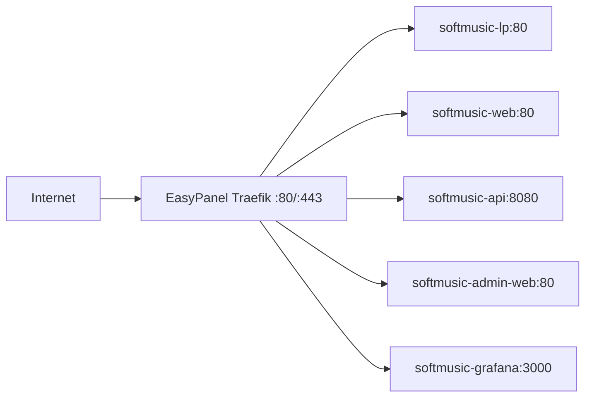

# SoftMusic + EasyPanel (Traefik) — Tutorial de deploy

Quando o **EasyPanel** já ocupa as portas **80/443** com o Traefik, o nginx/certbot
do SoftMusic **não deve** subir. O Traefik do EasyPanel faz TLS e roteamento para
os containers SoftMusic.

> **Não use** `softmusic-nginx`, `softmusic-certbot` nem `docker run certbot …`
> neste modo.

---

## Visão geral



| Domínio | Container | Porta interna |
|---------|-----------|---------------|
| `softmusic.com.br` / `www` | `softmusic-lp` | 80 |
| `app.softmusic.com.br` | `softmusic-web` | 80 |
| `app.softmusic.com.br/api/*` | `softmusic-api` | 8080 (strip `/api`) |
| `admin.softmusic.com.br` | `softmusic-admin-web` | 80 |
| `admin.softmusic.com.br/api/*` | `softmusic-api` | 8080 (`/api` → `/admin`) |
| `grafana.softmusic.com.br` | `softmusic-grafana` | 3000 |

---

## Modo automático (recomendado)

O job **`softmusic-admin`** (último da sequência) executa
`finalize-easypanel-edge.sh` ao final do deploy quando `EDGE_PROXY=easypanel`:

1. Copia `easypanel-softmusic.yaml` → `/etc/easypanel/traefik/config/softmusic.yaml`
2. Remove `softmusic-nginx` / `softmusic-certbot` se existirem
3. Conecta todos os containers à rede `easypanel`
4. Reinicia o Traefik do EasyPanel
5. Smoke test HTTPS (best-effort)

**Ordem dos jobs:** `softmusic-api` → `softmusic-web` → **`softmusic-admin`**

Os três jobs já têm default `EDGE_PROXY=easypanel` no Jenkinsfile. Não é
necessário SSH manual nem criar domínios na UI do EasyPanel (desde que o
Traefik carregue arquivos `.yaml` do diretório `config/`).

Passos manuais abaixo servem como fallback ou troubleshooting.

---

## Pré-requisitos

- [ ] DNS na Cloudflare apontando todos os domínios para o IP da VPS (**DNS only**)
- [ ] Jobs Jenkins já executados pelo menos uma vez: **infra** → **ia** → **api** → **web** → **admin**
- [ ] EasyPanel + Traefik rodando (`docker ps | grep easypanel-traefik`)
- [ ] Código com overlay `docker-compose.easypanel.yml` no repositório (push feito)

---

## Passo 1 — Descobrir a rede Docker do Traefik

Na VPS, como **root**:

```bash
TRAEFIK_ID=$(docker ps -q -f name=easypanel-traefik | head -1)
docker inspect "$TRAEFIK_ID" --format '{{range $k,$v := .NetworkSettings.Networks}}{{$k}}{{"\n"}}{{end}}'
```

Anote o nome (geralmente `easypanel`). Use-o no passo 2 se for diferente.

Teste:

```bash
docker network inspect easypanel >/dev/null && echo "Rede easypanel OK"
```

---

## Passo 2 — Ativar modo EasyPanel no Jenkins

Em **cada job** que roda `render-env.sh` (**web**, **api**, **admin**, **ia**, **infra**),
adicione variável de ambiente:

| Variável | Valor |
|----------|-------|
| `EDGE_PROXY` | `easypanel` |
| `TRAEFIK_DOCKER_NETWORK` | `easypanel` (ou o nome descoberto no passo 1) |

Caminho: *Job → Configure → Pipeline → Environment variables*.

Re-rode os jobs nesta ordem (para regenerar `.env.production` e reconectar redes):

1. `softmusic-infra` (ou `-legacy`)
2. `softmusic-ia`
3. `softmusic-api`
4. `softmusic-web`
5. `softmusic-admin`

---

## Passo 3 — Remover nginx/certbot do SoftMusic (conflito de porta)

Na VPS:

```bash
docker rm -f softmusic-nginx softmusic-certbot 2>/dev/null || true
docker ps -a --filter name=softmusic-nginx
# (não deve existir container Up na 80/443 com nome softmusic-nginx)
```

Confirme que só o Traefik usa 80/443:

```bash
ss -tlnp | grep -E ':80|:443'
# Deve mostrar o processo do easypanel-traefik
```

---

## Passo 4 — Instalar rotas Traefik (custom.yaml)

O arquivo modelo está em `infra/traefik/easypanel-softmusic.yaml` (copiado para
`/dados/jenkins_home/deploy/softmusic/traefik/` após um deploy Jenkins).

### 4.1 Copiar configuração

O arquivo só aparece em `${DEPLOY}/traefik/` **depois** de um job Jenkins
com o código atualizado (o `stage_assets` copia de `infra/traefik/`).

**Opção A — do workspace Jenkins** (se o repo já tem o arquivo):

```bash
# Caminho típico do checkout (ajuste o job se necessário)
REPO=$(docker exec jenkins ls -d /var/jenkins_home/workspace/Pipelines/softmusic/softmusic-web 2>/dev/null | head -1)
sudo cp "${REPO}/infra/traefik/easypanel-softmusic.yaml" \
  /etc/easypanel/traefik/config/custom.yaml
```

**Opção B — do deploy dir** (após re-rodar qualquer job com `stage_assets`):

```bash
DEPLOY=/dados/jenkins_home/deploy/softmusic
sudo cp "${DEPLOY}/traefik/easypanel-softmusic.yaml" \
  /etc/easypanel/traefik/config/custom.yaml
```

**Opção C — criar na VPS agora** (se A e B falharem — cole o bloco inteiro):

```bash
sudo mkdir -p /etc/easypanel/traefik/config
sudo tee /etc/easypanel/traefik/config/custom.yaml >/dev/null <<'EOF'
```

(cole o conteúdo de [`infra/traefik/easypanel-softmusic.yaml`](../../infra/traefik/easypanel-softmusic.yaml) — apenas a parte `http:` em diante, **sem** os comentários `#` do topo se preferir)

```bash
EOF
```

Ou baixe do GitHub (repo público):

```bash
sudo curl -fsSL \
  https://raw.githubusercontent.com/pablohalvim/softmusic/main/infra/traefik/easypanel-softmusic.yaml \
  -o /etc/easypanel/traefik/config/custom.yaml
```

> Se o branch principal não for `main`, troque na URL.

### 4.2 Reiniciar Traefik

No painel **EasyPanel → Settings → Restart Traefik** (ou equivalente).

Verifique logs:

```bash
docker logs $(docker ps -q -f name=easypanel-traefik | head -1) --tail 30
```

Não deve haver erro de sintaxe YAML.

---

## Passo 5 — Conectar containers à rede do Traefik

Após os jobs Jenkins, conecte manualmente (idempotente):

```bash
cd /dados/jenkins_home/deploy/softmusic
bash /var/jenkins_home/workspace/Pipelines/softmusic/softmusic-web/infra/docker/scripts/connect-traefik-network.sh
```

Ou, se preferir na VPS com o script do deploy dir (copie do repo):

```bash
export DEPLOY_DIR=/dados/jenkins_home/deploy/softmusic
export ENV_FILE="${DEPLOY_DIR}/.env.production"
export TRAEFIK_DOCKER_NETWORK=easypanel   # ajuste se necessário

for c in softmusic-lp softmusic-web softmusic-admin-web softmusic-api softmusic-grafana; do
  docker network connect easypanel "$c" 2>/dev/null || echo ">> $c já conectado ou inexistente"
done
```

Teste resolução **de dentro do Traefik**:

```bash
TRAEFIK_ID=$(docker ps -q -f name=easypanel-traefik | head -1)
docker exec "$TRAEFIK_ID" wget -qO- http://softmusic-web:80/ | head -5
docker exec "$TRAEFIK_ID" wget -qO- http://softmusic-api:8080/health/live
```

---

## Passo 6 — TLS automático (Let's Encrypt via Traefik)

Com DNS correto e rotas ativas, o Traefik emite certificados na **primeira requisição HTTPS**.

Aguarde 1–2 minutos e teste:

```bash
curl -I https://softmusic.com.br/
curl -I https://app.softmusic.com.br/
curl -sf https://app.softmusic.com.br/api/health/live && echo " API OK"
curl -I https://admin.softmusic.com.br/
curl -I https://grafana.softmusic.com.br/
```

Se o certificado demorar, force uma visita no browser ou veja logs do Traefik.

> **Não rode** o certbot standalone/container do SoftMusic — o EasyPanel já gerencia ACME.

---

## Passo 7 — Smoke test final

```bash
docker ps --format "table {{.Names}}\t{{.Status}}" | grep softmusic

# Rede easypanel — cada container deve aparecer
docker network inspect easypanel --format '{{range .Containers}}{{.Name}} {{end}}'
```

Checklist:

- [ ] `https://softmusic.com.br` — landing
- [ ] `https://app.softmusic.com.br` — app (login)
- [ ] `https://app.softmusic.com.br/api/health/live` — API
- [ ] `https://admin.softmusic.com.br` — painel admin
- [ ] `https://grafana.softmusic.com.br` — Grafana

---

## Troubleshooting

| Sintoma | Causa provável | Ação |
|---------|----------------|------|
| `Connection refused` no certbot/Let's Encrypt | Traefik não roteia ainda | Siga passos 4–5; não use certbot do SoftMusic |
| `softmusic-nginx` em `Created` | Conflito 80/443 com Traefik | `docker rm -f softmusic-nginx`; use `EDGE_PROXY=easypanel` |
| 502 Bad Gateway | Container fora da rede `easypanel` | Rode `connect-traefik-network.sh` |
| 404 no `/api` | Rotas Traefik ausentes | Confira `/etc/easypanel/traefik/config/custom.yaml` |
| Certificado inválido | DNS não propagou ou ACME falhou | Logs do Traefik; confirme DNS **DNS only** |
| `network easypanel not found` | Nome da rede diferente | Repita passo 1 e ajuste `TRAEFIK_DOCKER_NETWORK` |
| `certResolver letsencrypt` erro | Nome do resolver diferente no seu EasyPanel | Veja config estática: `docker exec $TRAEFIK_ID cat /etc/traefik/traefik.yml` e ajuste o YAML |

### Descobrir cert resolver do EasyPanel

```bash
TRAEFIK_ID=$(docker ps -q -f name=easypanel-traefik | head -1)
docker exec "$TRAEFIK_ID" traefik version
docker exec "$TRAEFIK_ID" cat /etc/traefik/traefik.yml 2>/dev/null | head -40
```

Se o resolver não se chamar `letsencrypt`, edite `custom.yaml` e troque
`certResolver: letsencrypt` pelo nome correto.

---

## Referências

- [Deploy em produção](./deploy-producao.md)
- [Portas, firewall e reverse proxy](./portas-firewall-reverse-proxy.md)
- [EasyPanel — Custom Traefik Config](https://easypanel.io/docs/guides/custom-traefik-config)
- Arquivo de rotas: [`infra/traefik/easypanel-softmusic.yaml`](../../infra/traefik/easypanel-softmusic.yaml)
- Overlay compose: [`infra/docker/docker-compose.easypanel.yml`](../../infra/docker/docker-compose.easypanel.yml)
