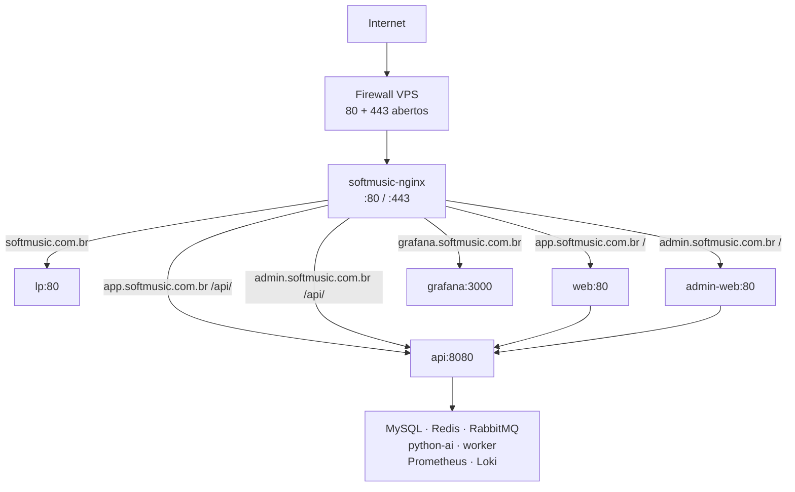

# Portas, firewall e reverse proxy (VPS)

Guia para liberar portas no firewall da VPS, configurar DNS e entender como o
**nginx** (`softmusic-nginx`) roteia o tráfego público para os containers.

Arquivos relacionados:

- `infra/nginx/conf.d/` — configs do edge nginx
- `infra/docker/docker-compose.prod.yml` — overlay de produção (portas expostas)
- [Deploy em produção](./deploy-producao.md)

## Visão geral



Todo acesso **público** passa pelo nginx. Serviços internos ficam apenas na rede
Docker `softmusic-network` (sem bind no host em produção).

---

## 1. Portas no firewall

### Abrir para a internet (obrigatório)

| Porta | Protocolo | Serviço | Motivo |
|-------|-----------|---------|--------|
| **80** | TCP | `softmusic-nginx` | HTTP — desafio ACME (Let's Encrypt) e redirect para HTTPS |
| **443** | TCP | `softmusic-nginx` | HTTPS — app, API, admin, landing, Grafana, webhook Asaas |

Com **80 + 443** você cobre:

- Landing: `https://softmusic.com.br`
- App: `https://app.softmusic.com.br`
- Admin: `https://admin.softmusic.com.br`
- Grafana: `https://grafana.softmusic.com.br`
- Webhook Asaas: `https://app.softmusic.com.br/api/webhooks/asaas`

### Restringir ao seu IP (administração)

| Porta | Protocolo | Uso | Recomendação |
|-------|-----------|-----|--------------|
| **22** | TCP | SSH | Abrir só para IPs confiáveis |
| **8080** | TCP | UI do Jenkins | **Não exponha** publicamente; use túnel SSH ou VPN |
| **50000** | TCP | Agentes Jenkins | Só se usar build agents remotos |

### Não abrir (bloqueados no overlay de produção)

Estes serviços **não** devem ser acessíveis de fora da VPS:

| Serviço | Porta (dev) | Produção |
|---------|-------------|----------|
| API (BFF) | 8080 | Sem bind no host — `nginx → api:8080` |
| python-ai | 8000 | Só rede Docker |
| Redis | 6379 | Sem bind no host |
| RabbitMQ | 5672 / 15672 | Sem bind no host |
| web / lp / admin-web | 5173 / 5180 / 5174 | Sem bind no host |
| Prometheus | 9090 | Sem bind no host |
| Loki | 3100 | Sem bind no host |
| Grafana | 3000 | Sem bind no host — acesso via nginx |
| OTel Collector | 4317 | Sem bind no host |

### MySQL (exceção — localhost only)

MySQL publica **apenas em `127.0.0.1:3307`** no host para manutenção via túnel SSH:

```bash
# Na sua máquina local
ssh -L 3307:127.0.0.1:3307 usuario@IP_DA_VPS

# Conectar em localhost:3307
```

**Nunca** libere a porta 3307 no firewall público.

---

## 2. Configurar UFW (Ubuntu)

```bash
# Reset opcional — cuidado se já tiver regras customizadas
sudo ufw default deny incoming
sudo ufw default allow outgoing

# SSH (ajuste se usar outra porta)
sudo ufw allow 22/tcp

# SoftMusic — tráfego público
sudo ufw allow 80/tcp
sudo ufw allow 443/tcp

sudo ufw enable
sudo ufw status verbose
```

### Cloud provider (Security Group / Network)

Se usar AWS, Hetzner, DigitalOcean, etc., replique as mesmas regras no painel:

- Inbound: **80**, **443** de `0.0.0.0/0` (e `::/0` se IPv6)
- Inbound: **22** restrito ao seu IP
- Deny explícito ou omitir: 3307, 6379, 5672, 8080, 8000, 9090, 3000

---

## 3. DNS

Crie registros **A** (ou CNAME) apontando para o IP da VPS:

| Registro | Tipo | Destino | Uso |
|----------|------|---------|-----|
| `softmusic.com.br` | A | IP da VPS | Landing page |
| `www.softmusic.com.br` | A ou CNAME | IP / `softmusic.com.br` | Alias |
| `app.softmusic.com.br` | A | IP da VPS | App cliente + API |
| `admin.softmusic.com.br` | A | IP da VPS | Painel administrativo |
| `grafana.softmusic.com.br` | A | IP da VPS | Grafana |

### DNS adicional (sem porta na VPS)

| Serviço | Onde configurar |
|---------|-----------------|
| E-mail (Resend) | SPF/DKIM no Cloudflare — [Deploy](./deploy-producao.md#e-mail-resend) |
| Storage (R2) | Bucket Cloudflare — saída HTTPS da VPS, sem porta inbound |
| Asaas webhook | URL pública via nginx — ver seção 4 |

---

## 4. Reverse proxy (nginx)

O container `softmusic-nginx` lê os arquivos em `infra/nginx/conf.d/` (copiados
para `DEPLOY_DIR/nginx/conf.d/` no deploy).

### Arquivos de configuração

| Arquivo | Quando ativo | Função |
|---------|--------------|--------|
| `00-upstreams.conf` | Sempre | Upstreams internos (api, web, lp, admin-web, grafana) |
| `production-http.conf` | Bootstrap (antes do TLS) | HTTP + ACME + proxy |
| `production-ssl.conf` | Após emitir certificados | HTTPS + redirect HTTP→HTTPS |
| `softmusic.conf` | **Só dev local** | Não vai para produção |

O script `prepare_nginx_tls()` (em `_common.sh`) ativa o SSL automaticamente
quando encontra certificados no volume `softmusic_certbot_certs`.

### Tabela de roteamento

| Domínio | Path público | Container destino | Path interno |
|---------|--------------|-------------------|--------------|
| `softmusic.com.br` | `/` | `lp:80` | SPA landing |
| `app.softmusic.com.br` | `/` | `web:80` | SPA do app |
| `app.softmusic.com.br` | `/api/*` | `api:8080` | `/*` (BFF) |
| `admin.softmusic.com.br` | `/` | `admin-web:80` | SPA admin |
| `admin.softmusic.com.br` | `/api/*` | `api:8080` | `/admin/*` |
| `grafana.softmusic.com.br` | `/` | `grafana:3000` | UI Grafana |

### URLs importantes

| Finalidade | URL |
|------------|-----|
| App | `https://app.softmusic.com.br` |
| API (front) | `https://app.softmusic.com.br/api` |
| Login | `https://app.softmusic.com.br/api/auth/login` |
| Webhook Asaas | `https://app.softmusic.com.br/api/webhooks/asaas` |
| Admin | `https://admin.softmusic.com.br` |
| Admin API | `https://admin.softmusic.com.br/api` |
| Landing | `https://softmusic.com.br` |
| Grafana | `https://grafana.softmusic.com.br` |

### Fluxo `/api/` no app

```
Browser  →  https://app.softmusic.com.br/api/songs
nginx    →  http://api:8080/songs
BFF      →  http://python-ai:8000/internal/songs  (+ headers auth)
```

No admin, `/api/` vira `/admin/` no BFF:

```
Browser  →  https://admin.softmusic.com.br/api/users
nginx    →  http://api:8080/admin/users
```

---

## 5. TLS (Let's Encrypt)

### Passo a passo

1. **DNS** apontando para a VPS (seção 3).
2. **Firewall** com 80 e 443 abertos (seção 2).
3. Subir stack com nginx em modo HTTP (`production-http.conf`):
   ```bash
   # Job Jenkins softmusic-web ou manualmente na VPS
   bash infra/docker/scripts/deploy-web.sh
   ```
4. **Emitir certificado** (todos os domínios de uma vez):
   ```bash
   docker run --rm \
     -v softmusic_certbot_certs:/etc/letsencrypt \
     -v softmusic_certbot_www:/var/www/certbot \
     certbot/certbot certonly --webroot -w /var/www/certbot \
     -d softmusic.com.br \
     -d www.softmusic.com.br \
     -d app.softmusic.com.br \
     -d admin.softmusic.com.br \
     -d grafana.softmusic.com.br \
     --email voce@softmusic.com.br --agree-tos --no-eff-email
   ```
5. **Ativar HTTPS** — re-rode `softmusic-web` ou `softmusic-admin`:
   - Copia `production-ssl.conf.example` → `production-ssl.conf`
   - Remove `production-http.conf`
   - Recria o container nginx

6. **Renovação automática**: o sidecar `softmusic-certbot` renova a cada 12h.

### Adicionar domínio depois

```bash
docker run --rm \
  -v softmusic_certbot_certs:/etc/letsencrypt \
  -v softmusic_certbot_www:/var/www/certbot \
  certbot/certbot certonly --webroot -w /var/www/certbot \
  --expand \
  -d softmusic.com.br -d www.softmusic.com.br \
  -d app.softmusic.com.br -d admin.softmusic.com.br \
  -d grafana.softmusic.com.br -d novo.softmusic.com.br \
  --email voce@softmusic.com.br
```

Depois adicione o `server` block no nginx e recarregue.

---

## 6. Checklist pós-configuração

```bash
# Na VPS — portas escutando (esperado: 80, 443, 8080 se Jenkins local)
sudo ss -tlnp | grep -E ':80|:443|:8080'

# Containers
docker ps --filter "name=softmusic" --format "table {{.Names}}\t{{.Status}}\t{{.Ports}}"

# HTTP bootstrap ou HTTPS
curl -I http://app.softmusic.com.br/
curl -I https://app.softmusic.com.br/health/live

# Grafana (requer job softmusic-infra com observabilidade)
curl -I https://grafana.softmusic.com.br/

# API via nginx
curl -sf https://app.softmusic.com.br/api/health/live && echo " API OK"
```

---

## 7. Troubleshooting

| Sintoma | Causa provável | Ação |
|---------|----------------|------|
| Site não abre de fora | Firewall / DNS | Conferir UFW e registros A |
| 502 Bad Gateway | Container downstream parado | `docker ps`; logs do serviço |
| Admin mostra app cliente | nginx apontava para `web` | Corrigido: upstream `softmusic_admin` |
| Grafana inacessível | DNS ou nginx sem vhost | Apontar `grafana.softmusic.com.br`; job infra |
| ACME falha | Porta 80 fechada ou DNS errado | Liberar 80; aguardar propagação DNS |
| nginx não sobe com SSL | Certificado ausente | Emitir certbot antes de ativar SSL |
| `Bind for 8080 failed` | Jenkins usa :8080 | Overlay prod já remove bind da API |
| MySQL inacessível remotamente | Bind em 127.0.0.1 | Usar túnel SSH (seção 1) |

---

## Referências

- [Deploy em produção](./deploy-producao.md)
- [Monitoramento](./monitoramento.md)
- [Credenciais Jenkins](../../infra/jenkins/credentials.md)
